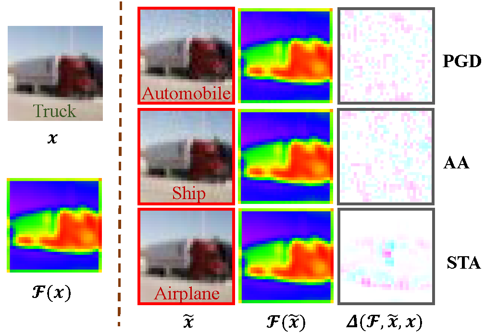
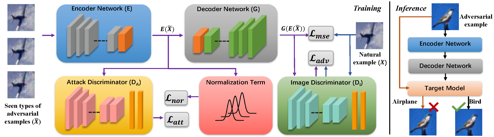

<div align="center"> 
  
# Towards Defending against Adversarial Examples via Attack-Invariant Features
[](http://proceedings.mlr.press/v139/zhou21e/zhou21e.pdf)

</div>

The implementation of [Towards Defending against Adversarial Examples via Attack-Invariant Features](http://proceedings.mlr.press/v139/zhou21e/zhou21e.pdf) (ICML 2021).

Deep neural networks (DNNs) are vulnerable to adversarial noise. Their adversarial robustness can be improved by exploiting adversarial examples. However, given the continuously evolving attacks, models trained on seen types of adversarial examples generally cannot generalize well to unseen types of adversarial examples. To solve this problem, in this paper, we propose to remove adversarial noise by learning generalizable invariant features across attacks which maintain semantic classification information. Specifically, we introduce an adversarial feature learning mechanism to disentangle invariant features from adversarial noise. A normalization term has been proposed in the encoded space of the attack-invariant features to address the bias issue between the seen and unseen types of attacks. Empirical evaluations demonstrate that our method could provide better protection in comparison to previous state-of-theart approaches, especially against unseen types of attacks and adaptive attacks


<p float="left" align="center">
 
<figcaption align="center">
  
A visual illustration of the natural example ($x$), adversarial example ($\tilde{x}$), latent feature ($\mathcal{F}(\cdot)$) and attack-specific feature ($\Delta(\mathcal{F},\tilde{x},x)=[\mathcal{F}(\tilde{x})\text{ - }\mathcal{F}(x)]\times10^{4}$). The latent feature is extracted from the first ReLu layer of the ResNet-110 model \citep{he2016deep}. Distinct types of attacks (e.g., PGD, AA and STA) generally only modify tiny information and their adversarial examples sufficiently retain invariant features from the natural example.
</figcaption>
</p>


<p float="left" align="center">
 
<figcaption align="center">
A visual illustration of our Adversarial noise Removing Network (ARN). Our main idea is to restore natural examples by exploiting invariant features. ARN is composed of an encoder network and a decoder network. The encoder network learns Attack-Invariant Features (AIF) via an adversarial feature learning mechanism and a normalization term. The decoder is trained to restore natural examples from AIF via a pixel similarity metric and an image discriminator.
</figcaption>
</p>


## Requirements
- This codebase is written for `python3` and `pytorch`.
- To install necessary python packages, run `pip install -r requirements.txt`.


## Experiments
### Training
- To generate adversarial data for training or testing the model

```
python craft_adversarial_examples.py
```

We use the "[advertorch](https://github.com/BorealisAI/advertorch)" toolbox to help generate adversairal samples. This code provides  PGD,  CW, [DDN](https://arxiv.org/abs/1811.09600) and [STA](https://openreview.net/forum?id=HyydRMZC-), etc., to generate different adversarial samples.

The generated samples can be saved with ".png" and ".npy" format. The storage directory defaults to "adv_example".


- To train the "Adversarial noise Removing Network (ARN)"?

```
python train_ARN.py
```

See './config/adver.yaml' for network configurations and data selection. 

The training data includes natural data and two types of adversarial data.


### Test
To test the ARN

```
python test_ARN.py
```

See './config/adver.yaml' for network configurations and data selection.

Input the natural or adversairal data into the ARN and obtain the processed data. Then, input the processed data into the target model.


## License and Contributing
- This README is formatted based on [paperswithcode](https://github.com/paperswithcode/releasing-research-code).
- Feel free to post issues via Github. 


## Reference
If you find the code useful in your research, please consider citing our paper:


<pre>
@inproceedings{zhou2021towards,
  title={Towards defending against adversarial examples via attack-invariant features},
  author={Zhou, Dawei and Liu, Tongliang and Han, Bo and Wang, Nannan and Peng, Chunlei and Gao, Xinbo},
  booktitle={International Conference on Machine Learning},
  pages={12835--12845},
  year={2021},
  organization={PMLR}
}
</pre>
